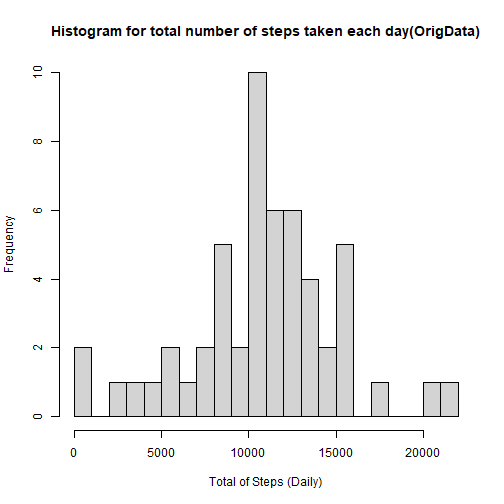
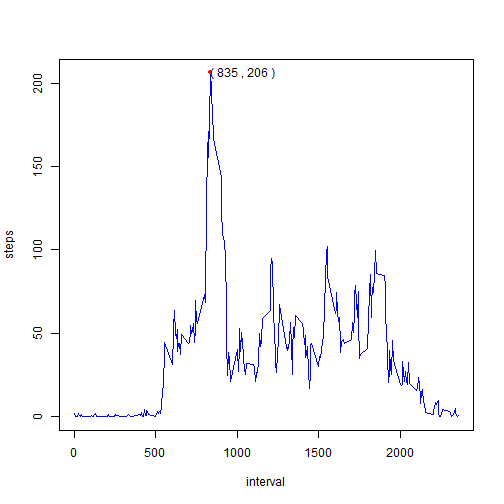
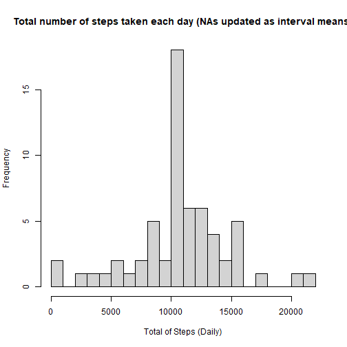
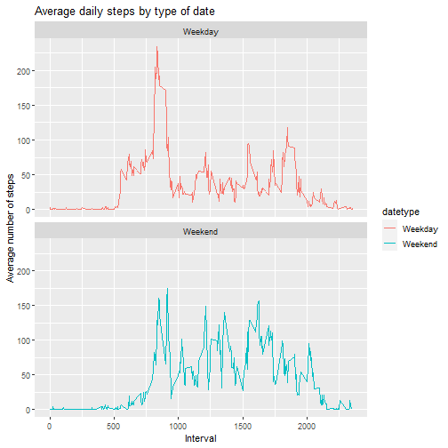

# Reproducible Research - Project Course 1


For this assignment, the data will be available at my Github repository, but  
you can also download it from  [here](https://d396qusza40orc.cloudfront.net/repdata%2Fdata%2Factivity.zip). 
  
I started reading the CSV file and saving into variable **OrigData**.  
After that, I subset the data removing the NAs, saving the output into variable
**actData** (keeping the original data for posterior use if necessary).  


```r
OrigData <- read.csv("activity.csv")
head(OrigData)
```

```
##   steps       date interval
## 1    NA 2012-10-01        0
## 2    NA 2012-10-01        5
## 3    NA 2012-10-01       10
## 4    NA 2012-10-01       15
## 5    NA 2012-10-01       20
## 6    NA 2012-10-01       25
```

```r
actData <- subset(OrigData, !is.na(OrigData$steps))
head(actData)
```

```
##     steps       date interval
## 289     0 2012-10-02        0
## 290     0 2012-10-02        5
## 291     0 2012-10-02       10
## 292     0 2012-10-02       15
## 293     0 2012-10-02       20
## 294     0 2012-10-02       25
```

```r
summary(actData)
```

```
##      steps            date              interval     
##  Min.   :  0.00   Length:15264       Min.   :   0.0  
##  1st Qu.:  0.00   Class :character   1st Qu.: 588.8  
##  Median :  0.00   Mode  :character   Median :1177.5  
##  Mean   : 37.38                      Mean   :1177.5  
##  3rd Qu.: 12.00                      3rd Qu.:1766.2  
##  Max.   :806.00                      Max.   :2355.0
```

### Histogram

 Let's create a histogram for the total number of steps taken each day:  


```r
TotalStepsD <- aggregate(steps~date, OrigData, sum)

hist(TotalStepsD$steps, 
     breaks = 30,
     xlab = "Total of Steps (Daily)",
     main = "Histogram for total number of steps taken each day(OrigData)")
```



### Averages

 Now lets take a look on the mean and median number of steps taken each day:


```r
avgD <- aggregate(steps~date, actData, mean)
head(avgD)
```

```
##         date    steps
## 1 2012-10-02  0.43750
## 2 2012-10-03 39.41667
## 3 2012-10-04 42.06944
## 4 2012-10-05 46.15972
## 5 2012-10-06 53.54167
## 6 2012-10-07 38.24653
```

```r
avg <- (aggregate(steps~interval, actData, mean))
paste("The mean interval is located at the ", 
      avg[avg$steps == max(avg$steps),1],
      "interval, with ",avg[avg$steps == max(avg$steps),2]," mean steps.")
```

```
## [1] "The mean interval is located at the  835 interval, with  206.169811320755  mean steps."
```

```r
med <- aggregate(steps~interval, actData, median)
paste("The median interval is located at the ", 
      med[med$steps == max(med$steps),1],
      "interval, with ",med[med$steps == max(med$steps),2]," median steps.")
```

```
## [1] "The median interval is located at the  845 interval, with  60  median steps."
```

### Plotting the average

 Plotting the average of steps:  


```r
plot(avg, type = "l", col = "blue")
points(avg[avg$steps == max(avg$steps),1],avg[avg$steps == max(avg$steps),2], 
       pch = 20, 
       col = "red")
text(avg[avg$steps == max(avg$steps),1]+200,avg[avg$steps == max(avg$steps),2],
     paste("(",as.character(trunc(avg[avg$steps == max(avg$steps),1])),",",
           as.character(trunc(avg[avg$steps == max(avg$steps),2])),")"))
```


 
### Missing Values

> Then total of missing values is **2304**.

The approach to impute the missing values will be to create a new data set called OrigData_imputed updating the missing values by the interval mean.


```r
imp_steps <- avg$steps[match(OrigData$interval, avg$interval)]

OrigData_imputed <- transform(OrigData, steps = ifelse(is.na(OrigData$steps), 
                                                       yes = imp_steps, no = OrigData$steps))
total_imp_steps <- aggregate(steps ~ date, OrigData_imputed, sum)
```

### The new histogram with imputed missing values


```r
hist(total_imp_steps$steps, 
     breaks = 30,
     xlab = "Total of Steps (Daily)",
     main = "Total number of steps taken each day (NAs updated as interval means)")
```



### Comparison of average number of steps taken per interval across weekdays and weekends.  

Lets start adjusting changing the data type for the date.


```r
OrigData$date <- as.Date(as.character(OrigData$date, "%Y%m%d"))
```

Now, lets create a new factor with two levels - "Weekday" and "weekend".


```r
OrigData$datetype <- sapply(OrigData$date, function(x) {
    if (weekdays(x) == "sábado" | weekdays(x) =="domingo") 
    {y <- "Weekend"} else 
    {y <- "Weekday"}
    y
})
```

Then, lets generate a times series plot in a panel plot (we are going to use ggplot2 for this):


```r
library(ggplot2)
OrigData_by_date <- aggregate(steps~interval + datetype, OrigData, mean, na.rm = TRUE)

ggplot(OrigData_by_date, aes(interval, steps, color=datetype))+
    geom_line()+
    labs(title = "Average daily steps by type of date", x = "Interval", 
         y = "Average number of steps") +
       facet_wrap(~datetype, ncol = 1, nrow=2)
```




